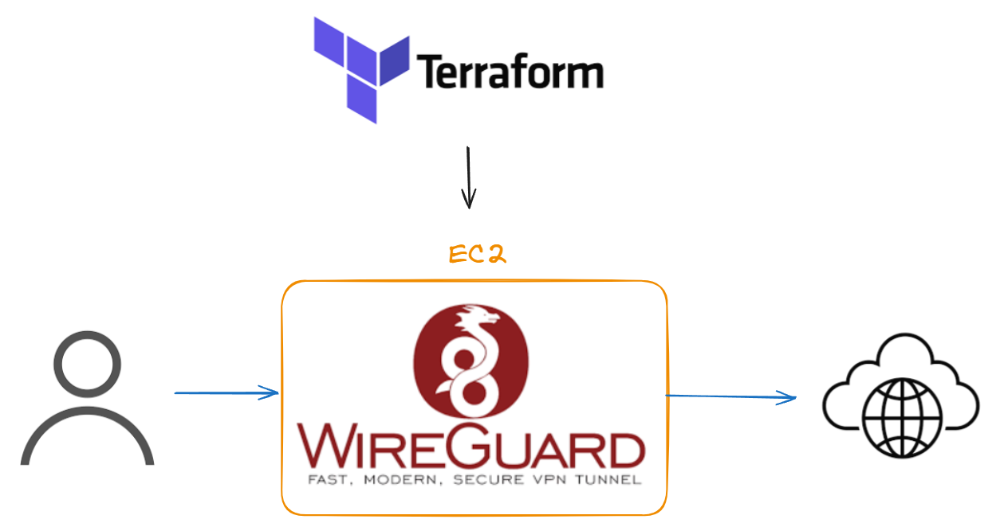

# aws-terraform-wireguard-vpn
aws-terraform-wireguard-vpn is a tool for fast vpn setup on aws ec2
!!! need to use ubuntu 22 (dont work on ubuntu 24 for some reason)

# aws-terraform-wireguard-vpn

`aws-terraform-wireguard-vpn` is a tool for quickly setting up a VPN server on AWS EC2 using WireGuard. It leverages Terraform to automate the deployment and configuration of a secure VPN server, providing a fast and reliable VPN solution.

## Features

- **Automated Deployment**: Easily deploy a VPN server on AWS EC2 with minimal manual intervention.
- **Secure and Fast**: Utilizes WireGuard, a modern VPN protocol known for its speed and security.
- **Customizable**: Configure various parameters such as instance type, region, and security settings through Terraform variables.
- **Efficient Management**: Automatically sets up necessary firewall rules using `iptables` for seamless VPN functionality.
  
## Requirements

- [Terraform](https://www.terraform.io/downloads) 1.0 or later
- An AWS account with permissions to create EC2 instances, security groups, and key pairs
- [WireGuard](https://www.wireguard.com/install/) client installed on devices connecting to the VPN

## Getting Started

### 1. Clone the Repository

```bash
git clone https://github.com/yourusername/aws-terraform-wireguard-vpn.git
cd aws-terraform-wireguard-vpn
